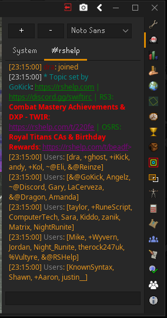
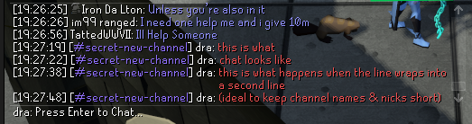
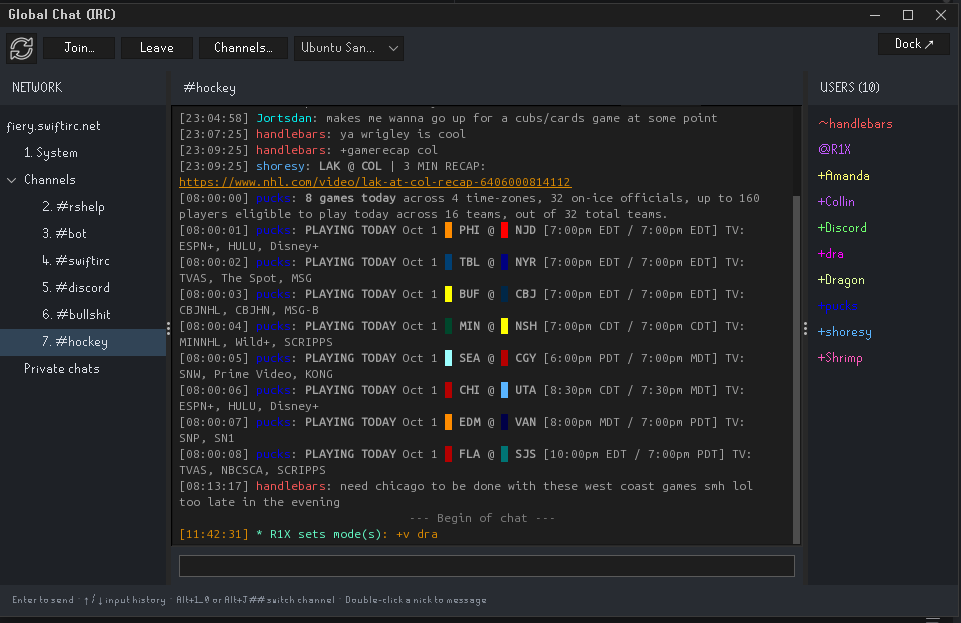

#  IRC Plugin

An integration with SwiftIRC through the OSRS chat box. Other IRC networks, and ZNC bouncers, can
be added alongside it (see [Multiple Networks and ZNC](#multiple-networks-and-znc)).

## Warning

This will share your IP with the administration of each IRC network you connect to:
SwiftIRC by default, and any other network or ZNC bouncer you add.

## Functionality

It is ideal to set the prefix to a character you can easily prefix IRC messages.

The default prefix is `;`. This document will use the default as reference.

### Channel Messages

Channel messages will show up in the chat box starting with the username that sent the message.

Sending a channel message: `;words can go here`

Example: `;Hello #rshelp!`

### Private Messages

Sending a private message: `;;msg <nick> <message>`

Example: `;;msg foobar Thanks for the information`

### Notices

Sending a notice: `;;notice <nick> <message>`

Example: `;;notice foobar Hey there!`

### Network Services

The following services run on SwiftIRC: NickServ, ChanServ, BotServ, HostServ, and MemoServ.

You may communicate via the following commands with the respective service:

```text
BotServ: ;;bs
ChanServ: ;;cs
HostServ: ;;hs
MemoServ: ;;ms
NickServ: ;;ns
NickServ Identification: ;;id
```

### Miscellaneous Commands

Commands work from the chat box with the prefix doubled (`;;join`), or from the side panel's
input box with a slash (`/join`). `;;help` lists them all. They act on the network of the
channel you have selected.

Join a channel: `;;join #cooking [key]` (with no channel, opens the channel browser)

Leave a channel: `;;part #cooking` (also `;;leave`; the current channel if omitted)

Browse the server's channel list: `;;list` (filter it, e.g. `;;list >50` for channels with more
than 50 users)

Change the focused channel: `;;go rsh`

Send an action: `;;me waves`

Look up a user: `;;whois foobar`

Look up a user who has left: `;;whowas foobar`

Set or clear your away status: `;;away brb` / `;;away`

Change your nick: `;;nick foo bar` (spaces become underscores: `foo_bar`)

List the users in the current channel: `;;names`

View or set the topic: `;;topic` / `;;topic #rshelp New topic`

Change channel modes: `;;mode #rshelp -s`

Change user modes: `;;umode +R`

Clear the side panel: `;;clear`

Open IRC in its own window: `;;popout`

Add, edit, or remove IRC networks: `;;networks`

Disconnect from the selected channel's network: `;;quit [message]`

## Configuration

### Connection

These settings are for SwiftIRC. Other networks are set up in the Networks dialog (see
[Multiple Networks and ZNC](#multiple-networks-and-znc)), which is also where SwiftIRC's
**Connect automatically** and **Show in game chat** switches live.

#### server

Fiery (West-USA) or London (UK).

More details are available at SwiftIRC.net:
https://swiftirc.net/info/

#### username

The username used to connect to SwiftIRC.

#### account name (optional)

The NickServ account to identify against, if it differs from your nick. Leave blank to identify
by nick.

#### password (optional)

The password to identify with NickServ. Never your RuneScape password.

#### channel(s) (optional)

The channel(s) you intend to join, comma separated. Leaving this blank will default to #rshelp.

#### channel password (optional)

The key for a channel that requires one.

### General

#### prefix

Defaults to `;`. Prefixed to messages destined for IRC.

#### active channel only

Only show the active channel messages in the OSRS chat box. The "active channel" is the active tab in the side panel.

#### backtick channel navigation

In game, press `` ` `` to switch to the next channel and `` shift+` `` for the previous one. On by
default.

#### page up/down channel navigation

In game, press Page Down to switch to the next channel and Page Up for the previous one. On by
default.

#### autofocus on new tab

When a new tab opens, autofocus on it. This means sending/receiving a notice/message to a target, without an open tab,
will change the active channel to this target.

#### server notice tab

Server notices will default to the System tab; you can optionally allow them to create their own tab.

#### chatbox type

Which in-game chat box IRC messages appear in: Friends Chat (default) or Clan Chat.

#### notice window / PM window

Where notices and private messages are shown: in the current window (default), in the System
tab, or in a private window with the sender.

#### hide join/part/quit/kick

Hide joins, parts, quits, and kicks from channel windows.

#### join/part/quit/kick/nick/mode stay read

Joins, parts, quits, kicks, nick changes, and channel mode changes don't mark a channel as unread,
so only conversation does. On by default; turn it off to have them mark the channel unread like
any other message.

#### log raw IRC lines

Writes every IRC line sent and received to the RuneLite client log. Off by default. Turn it on
only when you are chasing a connection problem, then turn it back off - it is noisy.

Credentials are stripped before anything is written, so the log is safe to attach to a bug report:
the SASL exchange, server passwords, NickServ and ChanServ commands that carry a password, and
channel keys (from `JOIN`, from `MODE +k`, and from the server's own reply when you join a keyed
channel). What remains is the protocol traffic itself.

#### custom in-game text colour / in-game text colour

Colour IRC messages in the in-game chat box with a colour of your choice. Off by default, in
which case they follow RuneLite's Chat Colour settings.

#### IRC colours in-game

Show IRC colour codes in the in-game chat box instead of stripping them. On by default.
Background colours are not shown, as the chat box cannot draw them.

### Overlay

#### enable in-game overlay

Show the IRC overlay inside the game. On by default.

#### overlay the chat box

Place the overlay over the chat box (default), or turn this off for an overlay you can move with
alt+click & drag.

#### overlay max width

Maximum width of the overlay, in pixels. Defaults to 500.

#### active channel only

Show only the active channel's tab in the overlay, instead of a tab for every channel. Off by
default.

### Side Panel

#### enabled

Whether IRC's panel will appear in the sidebar. The pop-out window works either way.

#### pop out window

Click the **^** button in the IRC sidebar panel, or type `;;popout` in the chat box, to move IRC
into a separate, resizable window. `;;popout` works even when **Enabled** is off, and brings the
window to the front if it is already open.
Drag its title bar to move it, including to another monitor. All chat controls remain
interactive: type messages, switch channels, browse channels, and click links as usual.
The expanded layout includes a channel tree with unread markers, chat in the center, and a user
list on the right. Drag the dividers to adjust column widths. The **Channel list** and **User
list** buttons hide or show either side.

The tree has one entry per network, marked ● when connected and ○ when not, each with its System
buffer, its channels, and its private chats. Drag a network to reorder the networks, or a channel
within its network to reorder its channels; the order is remembered. Right-click a network to
Reconnect, Connect or Disconnect it, or Edit it. Clicking a channel in the tree moves the cursor
to the input box so you can type straight away. Channels are numbered down the whole tree,
matching the **Alt+number** shortcuts, and **Alt+↑** / **Alt+↓** step through them in the same
order (see [Keyboard Shortcuts](#keyboard-shortcuts)). A strip along the bottom of the window lists
the shortcuts, wrapping onto more lines when the window is narrow.

Above the chat are the channel's name (with its network once two are connected) and its topic.
Links in the topic are clickable, and a long topic scrolls sideways - use the scrollbar or the
mouse wheel. Double-click a nick (or press Enter on it) to open a private conversation;
right-click for Message and WHOIS.

Back-to-back joins, parts, quits, kicks, and nick changes are condensed onto one line, grouped
by kind: `* Joins: alice, gina · Parts: carol · Quits: bob · Nicks: dave → dave_ · Kicks: frank (by eve)`.
Each nick appears once per group, so someone hopping in and out doesn't repeat; every nick change
is listed. Reasons are left out, and the timestamp is when the run began. A lone event keeps its
usual line, and any other message starts a new run. The sidebar still shows one line per event.

The toolbar provides Reconnect, Join, Leave, Channels, and Networks for the selected channel's
network, font and font size selectors, and Dock. Docking restores the compact sidebar layout.
The same chat controls are reused, preserving scrollback, the selected channel, and unsent text
without reconnecting to IRC.

Click **Dock**, or close the window with its **X**, to return IRC to the RuneLite
sidebar. Click the IRC sidebar icon to view it there. If **Enabled** is off, docking just closes
the window. The window's size and position, and whether it was maximized, are remembered, even
after RuneLite restarts; if it was on a monitor that is no longer connected, it opens centred on
RuneLite instead. Disabling the plugin also closes the pop-out.

#### keep pop-out on top

Optionally keep the pop-out above other windows. Off by default.

#### timestamp

Prefix messages with a timestamp in the format of `[hour:minute:second]`.

#### hover-preview image links

Enable to preview image links by hovering your mouse over them. WARNING: this will make it easier to share your IP with
an image host.

#### colorized nicks

Add a color to nicks appearing in the side panel.

#### position in sidebar

Specifically where the side panel appears on the right, from top to bottom.

#### maximum scrollback per channel

How many messages each channel keeps, to avoid lag. Defaults to 100.

#### font family / font size

The font IRC uses, and its size in the side panel and pop-out window. The pop-out also has a font
selector in its toolbar.

#### chat background / chat text colour

The background colour of the chat area, and the colour of regular chat messages. Joins, parts,
notices, and IRC colour codes keep their own colours.

## Screenshots






## Guide

### Keyboard Shortcuts

In the side panel or pop-out window:

| Keys | Action |
| --- | --- |
| **Alt+1** … **Alt+9** | Jump to channels 1–9 |
| **Alt+0** | Jump to channel 10 |
| **Alt+J**, then two digits | Jump to any channel, e.g. **Alt+J 1 1** for the eleventh |
| **Alt+H** | Mark every channel as read |
| **Alt+↑** / **Alt+↓** | Move to the channel above / below, wrapping around at the ends |
| **Alt+/** | Go back to the channel you were last in |
| **Alt+<** / **Alt+>** (or **Alt+,** / **Alt+.**) | Step back / forward through the channels you've visited |
| **Tab** / **Shift+Tab** | Complete a nick or channel name |
| **↑** / **↓** | Recall previously sent messages |
| **Ctrl+B** / **Ctrl+I** / **Ctrl+U** | Insert bold / italic / underline formatting |
| **Ctrl+K** | Insert a colour code |

On macOS, use **Option** for **Alt** and **Cmd** for **Ctrl**. Channel numbers follow the
pop-out's channel tree, or the tab order in the side panel.

In game, `` ` `` / `` shift+` `` and Page Up / Page Down switch channels (see the settings above).

### Browsing Channels

Run `;;list`, or `;;join` with no channel, to open the channel browser. Filter it by name or
topic, sort by any column, and double-click a channel (or select it and press Enter or **Join**) to
join it. The **Channels** button in the pop-out opens the same browser.

### Multiple Channels

Auto-joining multiple channels is possible by comma separating them in the settings:
```text
#rshelp,#swiftirc,#cooking
```

### Multiple Networks and ZNC

SwiftIRC is always listed. To connect to another network at the same time, open the Networks
dialog with the **Networks…** button in the pop-out or `;;networks`, and click **Add…**:

| Field | |
| --- | --- |
| Name, Host, Port | The network as it appears in the tree, and where to connect |
| Use TLS / Verify TLS certificate | Encrypt the connection, and check the server's certificate. Untick **Verify** only for a server with a self-signed certificate; the connection stays encrypted but is not authenticated, and its System buffer says so |
| Nick | Blank uses your **username** setting |
| Server password | Sent before registering. ZNC reads `username/network:password` from it |
| SASL account / password | For networks that log you in with SASL |
| Autojoin | Channels to join on connect, comma separated |
| Connect automatically | Off leaves the network listed but disconnected; **Connect** still works by hand |
| Show in game chat | See below |

**ZNC.** The **ZNC preset** button turns TLS on. Add one entry per ZNC network; **Duplicate**
copies an entry so only the `username/network` part of the password needs changing. When you
connect, ZNC replays what you missed: those lines keep their original times, show as history, and
don't mark channels unread. Lines you type in another client attached to the same ZNC appear too.

**In-game chat.** Only one network's chat is shown in the game's chat box and overlay: SwiftIRC
unless you tick **Show in game chat** on another. Messages you type in game with the prefix go to
the channel selected in the side panel or pop-out, whichever network it belongs to. If you reach
SwiftIRC through a ZNC, edit SwiftIRC in the dialog, untick **Connect automatically**, and tick
**Show in game chat** on your ZNC entry instead.

**Order.** **Move up** / **Move down** in the dialog, or dragging in the pop-out's tree, reorders
networks; dragging a channel reorders it within its network. Channels are also joined in that
order.

In the side panel, other networks' channels are listed with the network's name, e.g.
`#foo (Rizon)`. The same channel name on two networks is two separate channels.

### Registering a Nick

To run commands, it is recommended to use the `System` tab of the side panel.

Once there, it is possible to register your nick and email (where the email is primarily required to reset a lost password):
```text
/ns register <password> <email>
```

You can now save the password in the settings for the plugin. This will automatically identify you when you connect.

Once you have registered your nick, you can join registered-only channels and register new channels.

### Registering a Channel

These commands will create and register a new channel:
```text
/join #secret-new-channel
/cs register #secret-new-channel
```

### IRC Help

You can ask in `#irchelp` for IRC-specific questions.
```text
/join #irchelp
```

## Troubleshooting Connection Problems

The plugin reports why a connection failed rather than leaving you to guess. When something goes
wrong you should see one of:

- **A reason from the server.** `Server closed the link: Closing Link: you[1.2.3.4] (Ping timeout:
  240 seconds)`, `Killed by <operator>: <reason>`, or `Server error 465: You are banned from this
  server`. This is the server's own text - it is the most useful thing to include in a report.
- **A reason from the network.** `DNS lookup failed: irc.swiftirc.net could not be resolved`, or
  `Failed while connecting to irc.swiftirc.net:6697 - ConnectException: Connection refused`. The
  message names what was being attempted (connecting, the TLS handshake, registering, or reading
  from an established connection) so a firewall problem is distinguishable from a server problem.
- **A silent close.** `Connection closed: server closed the connection during registration,
  without saying why` usually means the server dropped you without explanation - a ban or a
  connection throttle.

Disconnect messages carry the cause where one is known, so `Disconnected from IRC (Ping timeout:
240 seconds)` tells you it was not your own `/quit`.

Each network reports in its own System buffer. A TLS handshake failure against a ZNC or server
with a self-signed certificate usually means **Verify TLS certificate** needs to be unticked for
that network in the Networks dialog.

If a problem is not reproducible, enable **log raw IRC lines** in the plugin settings and
reproduce it. The full protocol exchange, with passwords removed, is written to the RuneLite
client log. The setting takes effect immediately, so you can turn it on before reconnecting.
