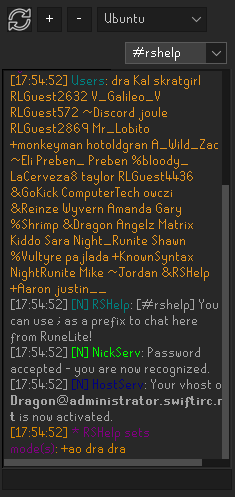
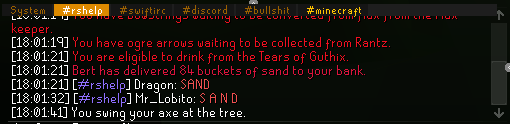

#  IRC Plugin

An integration with SwiftIRC through the OSRS chat box.

## Warning

This will share your IP with the SwiftIRC administration.

## Functionality

It is ideal to set the prefix to a character you can easily prefix IRC messages.

The default prefix is `;`. This document will use the default as reference.

### Channel Messages

Channel messages will show up in the chat box starting with the username that sent the message.

Sending a channel message: `;words can go here`

Example: `;Hello #rshelp!`

### Private Messages

Sending a private message: `;;msg <nick> <message>`

Example: `;;msg foobar Thanks for the information`

### Notices

Sending a notice: `;;notice <nick> <message>`

Example: `;;notice foobar Hey there!`

### Network Services

The following services run on SwiftIRC: NickServ, ChanServ, BotServ, HostServ, and MemoServ.

You may communicate via the following commands with the respective service:

```text
BotServ: ;;bs
ChanServ: ;;cs
HostServ: ;;hs
MemoServ: ;;ms
NickServ: ;;ns
```

### Miscellaneous Commands

Clear the side panel: `;;clear`

Change channel modes: `;;mode #rshelp -s`

View the topic: `;;topic`

Change user modes: `;;umode +R`

Change the focused channel: `;;go rsh`

## Configuration

### Connection

#### server

USA or UK.

More details are available at SwiftIRC.net:
https://swiftirc.net/info/

#### username

The username used to connect to SwiftIRC.

#### password (optional)

The password to identify with NickServ.

#### channel (optional)

The channel you intend to join. Leaving this blank will default to #rshelp.

#### channel password (optional)

### General

#### prefix

Defaults to `;`. Prefixed to messages destined for IRC.

#### active channel only

Only show the active channel messages in the OSRS chat box. The "active channel" is the active tab in the side panel.

#### hover-preview image links

Enable to preview image links by hovering your mouse over them. WARNING: this will make it easier to share your IP with
an image host.

#### autofocus on new tab

When a new tab opens, autofocus on it. This means sending/receiving a notice/message to a target, without an open tab,
will change the active channel to this target.

#### server notice tab

Server notices will default to the System tab; you can optionally allow them to create their own tab.

### Side Panel

#### enabled

Whether the side panel will appear.

#### timestamp

Prefix messages with a timestamp in the format of `[hour:minute:second]`.

#### colorized nicks

Add a color to nicks appearing in the side panel.

#### priority

Specifically where the side panel appears on the right, from top to bottom.

## Screenshots





## Guide

### Multiple Channels

Auto-joining multiple channels is possible by comma separating them in the settings:
```text
#rshelp,#swiftirc,#cooking
```

### Registering a Nick

To run commands, it is recommended to use the `System` tab of the side panel.

Once there, it is possible to register your nick and email (where the email is primarily required to reset a lost password):
```text
/ns register <password> <email>
```

You can now save the password in the settings for the plugin. This will automatically identify you when you connect.

Once you have registered your nick, you can join registered-only channels and register new channels.

### Registering a Channel

These commands will create and register a new channel:
```text
/join #secret-new-channel
/cs register #secret-new-channel
```

### IRC Help

You can ask in `#irchelp` for IRC-specific questions.
```text
/join #irchelp
```